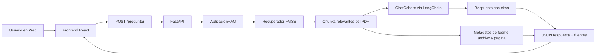
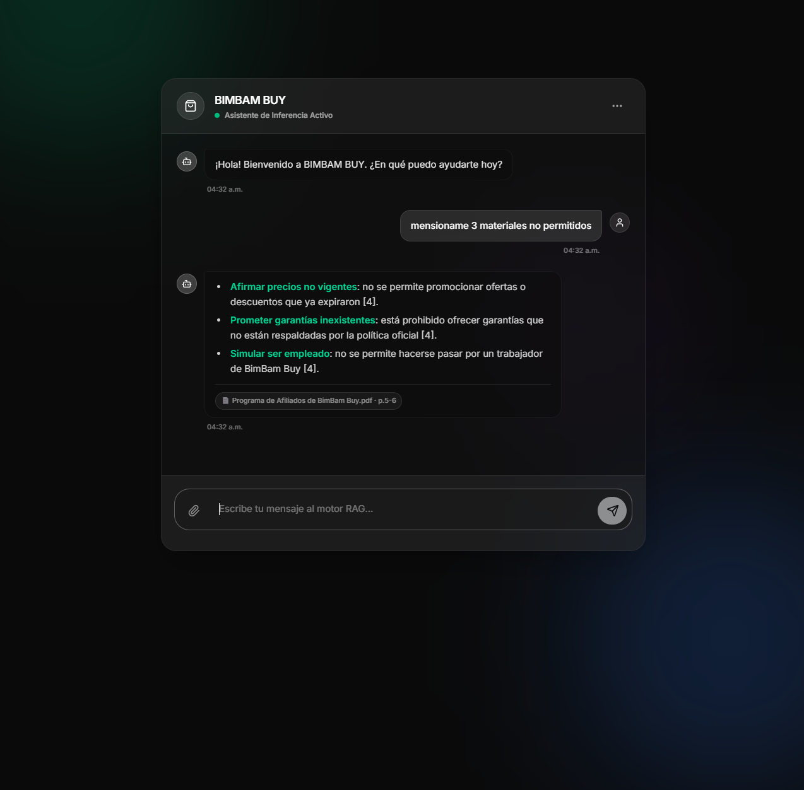
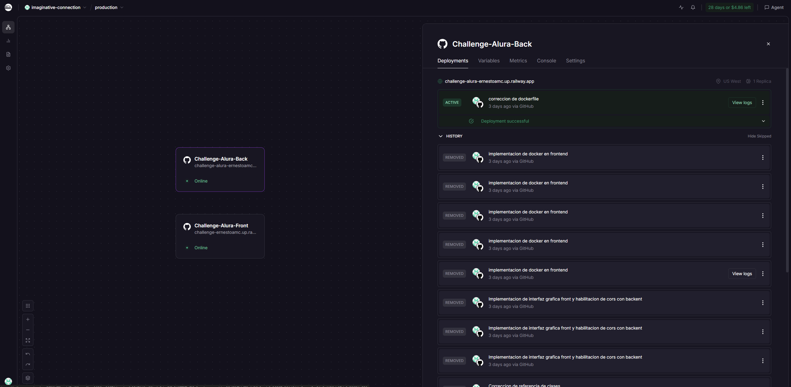
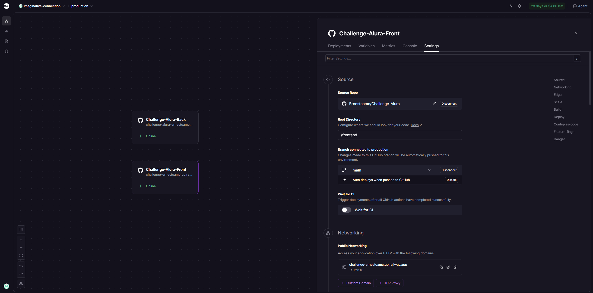
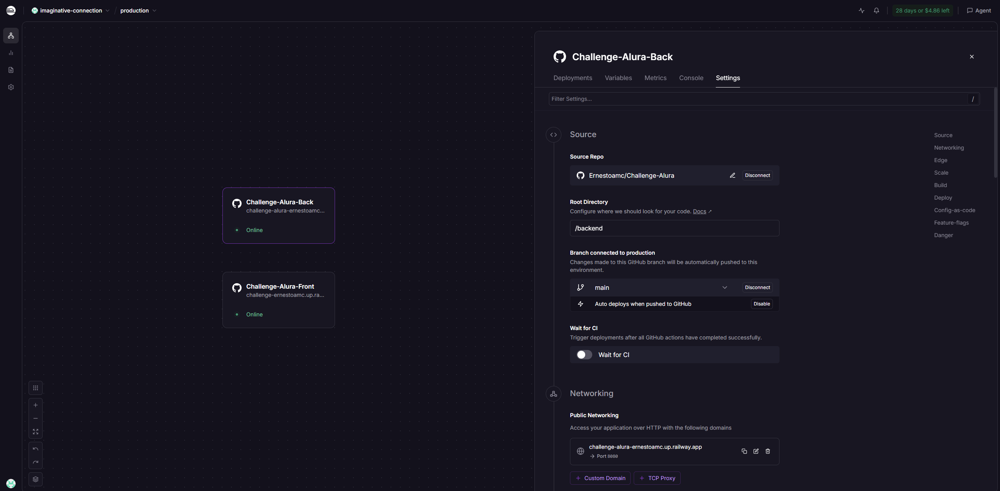

# Agente IA RAG - BIMBAM BUY

Aplicacion web con arquitectura RAG que permite consultar documentos PDF en lenguaje natural. Incluye una interfaz de chat para usuarios, una API en FastAPI para procesar consultas y un motor de recuperacion semantica con LangChain + FAISS + Cohere. El sistema se encuentra desplegado en Railway.

## 1. Objetivo del proyecto

Reducir el tiempo de busqueda de informacion en documentos internos mediante un agente de IA que recupere contexto relevante y genere respuestas claras a preguntas en lenguaje natural. En lugar de revisar manualmente paginas completas, el usuario consulta desde la interfaz y obtiene una respuesta fundamentada en el contenido del documento procesado.

Capacidades implementadas:

- Lectura y procesamiento de documentos PDF.
- Indexacion vectorial del contenido para recuperacion semantica.
- Respuesta en lenguaje natural usando un LLM.
- Exposicion por API y cliente web.
- Arquitectura preparada para despliegue en nube (Railway).

## 2. Arquitectura

El backend sigue una aproximacion por puertos y adaptadores (hexagonal) para separar dominio de infraestructura.

### Componentes

- Frontend (React + Vite + Tailwind): interfaz de chat para preguntas/respuestas.
- API (FastAPI): endpoint HTTP para consultas.
- Dominio RAG: orquesta carga, indexacion y consulta.
- Adaptador de carga documental: lectura y fragmentacion de PDFs.
- Almacen vectorial: embeddings + FAISS para recuperacion.
- LLM: generacion de respuesta final condicionada por contexto recuperado.

### Flujo de alto nivel



## 3. Estructura del repositorio

```text
backend/
  app.py
  main.py
  requirements.txt
  Dockerfile
  core/
    dominio/
      casosDU.py
      puertos.py
    infraestructura/
      adaptadores.py
  data/
frontend/
  src/
    App.tsx
  package.json
  Dockerfile
```

## 4. Tecnologias utilizadas

### Backend

- Python
- FastAPI
- LangChain + LangChain Community + LangChain Cohere
- FAISS
- PyPDF
- python-dotenv

### Frontend

- React
- TypeScript
- Vite
- Tailwind CSS

### Despliegue

- Contenedores Docker
- Railway

## 5. Como funciona el agente

1. Al iniciar el backend, se cargan documentos desde backend/data.
2. Los documentos se dividen en chunks.
3. Se generan embeddings y se construye el indice FAISS.
4. Cuando el usuario pregunta, se recuperan los chunks mas relevantes.
5. El LLM construye la respuesta usando ese contexto.

## 6. API

### Endpoint principal

- Metodo: POST
- Ruta: /preguntar
- Body JSON:

```json
{
  "pregunta": "Resume el proceso tecnico de atencion de casos."
}
```

- Respuesta JSON:

```json
{
  "respuesta": "El proceso tecnico incluye apertura del caso, validacion documental, diagnostico inicial, resolucion y seguimiento, con registro de orden, evidencia, diagnostico y estado final."
}
```

Ejemplo de consumo por HTTP:

```bash
curl -X POST "https://challenge-alura-ernestoamc.up.railway.app/preguntar" \
  -H "Content-Type: application/json" \
  -d '{"pregunta":"Resume el proceso tecnico de atencion de casos."}'
```

## 7. Ejemplos de preguntas y respuestas

Pruebas realizadas contra el endpoint publicado en Railway:

- Endpoint: [https://challenge-alura-ernestoamc.up.railway.app/preguntar](https://challenge-alura-ernestoamc.up.railway.app/preguntar)
- Fecha de prueba: 2026-07-18

1. Pregunta: "Resume el proceso tecnico de atencion de casos."
   Respuesta resumida de la API: recepcion de solicitud, validacion inicial, clasificacion del caso, diagnostico inicial, resolucion tecnica, comunicacion al cliente y seguimiento.

2. Pregunta: "Que datos se deben registrar en cada incidencia logistica?"
   Respuesta resumida de la API: numero de orden, estado logistico, fecha del evento, operador involucrado, accion tomada y resultado final.

3. Pregunta: "Que recomendaciones da el documento para comunicacion con clientes?"
   Respuesta resumida de la API: comunicacion clara y respetuosa, lenguaje simple, evitar promesas antes de validar, explicar siguiente paso, mantener consistencia entre canales y explicar motivo de rechazo con opciones.

4. Pregunta: "Que informacion debe incluir la respuesta al cliente?"
   Respuesta resumida de la API: estado actual, causa probable, accion recomendada, plazo estimado, condicion de seguimiento, cobertura aplicable, decision tomada y proximos pasos.

5. Pregunta: "Resume las recomendaciones para crear contenido confiable."
   Respuesta resumida de la API: contenido honesto y util, beneficios reales, evitar afirmaciones absolutas, consistencia visual de marca, enlaces oficiales, transparencia promocional y cumplimiento de reglas locales.

## 8. Ejecucion local

### Requisitos

- Python 3.12+
- Node.js 20+
- Clave de Cohere (COHERE_API_KEY)

### 8.1 Backend

Desde backend/:

```bash
pip install -r requirements.txt
uvicorn app:app --reload --port 8000
```

Variables de entorno sugeridas:

- COHERE_API_KEY: clave del modelo.
- FRONTEND_URLS: origenes permitidos por CORS separados por coma.
  Ejemplo: [http://localhost:5173,http://localhost:5174](http://localhost:5173,http://localhost:5174)

### 8.2 Frontend

Desde frontend/:

```bash
npm install
npm run dev
```

Variable de entorno requerida:

- VITE_API_URL: URL completa del endpoint /preguntar.
  Ejemplo: [http://localhost:8000/preguntar](http://localhost:8000/preguntar)

## 9. Ejecucion con Docker

### 9.1 Backend (Docker)

Desde backend/:

```bash
docker build -t agente-rag-backend .
docker run -p 8000:8000 --env COHERE_API_KEY=TU_KEY --env FRONTEND_URLS=http://localhost:5173 agente-rag-backend
```

### 9.2 Frontend (Docker)

Desde frontend/:

```bash
docker build -t agente-rag-frontend --build-arg VITE_API_URL=http://localhost:8000/preguntar .
docker run -p 8080:80 agente-rag-frontend
```

## 10. Evidencia de despliegue en Railway

Despliegue publico del sistema:

- Frontend (interfaz para cliente): [https://challenge-ernestoamc.up.railway.app/](https://challenge-ernestoamc.up.railway.app/)

Despliegue publico del backend (API):

- URL base: [https://challenge-alura-ernestoamc.up.railway.app](https://challenge-alura-ernestoamc.up.railway.app)
- Endpoint de consultas: [https://challenge-alura-ernestoamc.up.railway.app/preguntar](https://challenge-alura-ernestoamc.up.railway.app/preguntar)

Ejemplo de prueba por HTTP:

```bash
curl -X POST "https://challenge-alura-ernestoamc.up.railway.app/preguntar" \
  -H "Content-Type: application/json" \
  -d '{"pregunta":"Resume el proceso tecnico de atencion de casos."}'
```

Captura de evidencia:

- Aplicación ejecutándose correctamente



- Deployment del backend RAG en Railway:



- Settings de frontend en Railway (URL publica):



- Settings de backend en Railway (URL API):



## 11. Decisiones de diseno

- Se uso arquitectura por puertos/adaptadores para desacoplar el dominio de las librerias.
- FAISS permite consultas semanticas locales de baja latencia.
- El frontend desacoplado consume la API por variable de entorno.
- Se provee modo CLI (backend/main.py) y modo API (backend/app.py).
